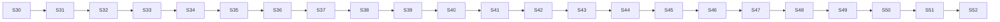

---
tags:
  - backlog
  - plano
  - paridade
  - v8
  - sprints
created: 2026-04-20
last_updated: 2026-04-20
status: vivo
referencia: "[[Analise Comparativa v8 vs Torque-v2]]"
---

# Plano de Ação — Paridade Funcional com v8 (Sprints S30–S52)

> Continuação LINEAR CUMULATIVA a partir de `develop @ a1e9e65` (S29 concluído). Cada sprint mantém o protocolo inviolável do CLAUDE.md §"Protocolo de git — sprints".
>
> **Premissa fundamental**: v8 é a referência **funcional** (o que o produto faz); a stack do Torque-v2 (Go 1.22 + pgx + React 18 + TanStack v5 + ADRs 001-007) é a referência **técnica**. Não portamos código v8 — portamos conhecimento (entities, action types, UX flows, copy PT-BR). A re-implementação será mais eficiente por design (cursor pagination, WS patches-only, httpOnly cookies, CSP tight, Go em vez de Edge Functions).

## Princípios de decomposição

1. **Uma feature por vez** (regra cardinal CLAUDE.md). Mesmo nas trilhas paralelizáveis, cada sprint tem um dono lógico.
2. **Topologia linear cumulativa**: `sprint/S0X` nasce de `develop` atualizada, merge `--no-ff` de volta, sprint anterior permanece como anchor.
3. **Commits por domínio**: DBA → Backend → QA → Frontend → Docs (STATE D0xx).
4. **Fechamento inviolável**: STATE.md D0xx + Indice status line + Plano Mestre §8 ENTREGUE + push sprint/S0X + PR para develop.
5. **Gate de qualidade por sprint**: vitest verde, typecheck+lint zero warnings, integration tests (quando aplicável) gated por DATABASE_URL. Cobertura sobe a cada sprint rumo a 70% em S40.
6. **Segurança é invariante**: nenhuma sprint introduz feature que relaxe ADR-003 (httpOnly cookies), ADR-004 (cursor pagination), StripOrganizationID middleware, CSP tight, ou rate limiter. Se um requisito do v8 colide com um ADR, re-design a feature.

## Tamanho das sprints

- **S** (Small): ≤1 semana, 3-5 arquivos alterados, uma entidade de domínio.
- **M** (Medium): 1-2 semanas, 1 feature vertical.
- **L** (Large): 2-3 semanas, feature cross-domain ou nova integração externa.

## Sumário do plano (23 sprints, ~28 semanas)

| Fase                                        | Sprints        | Objetivo                                                                               | Semanas         |
| ------------------------------------------- | -------------- | -------------------------------------------------------------------------------------- | --------------- |
| **Fase A — Foundation repair (P0)**         | S30–S32        | Lazy loading, vitest thresholds, tenant isolation tests, Dependabot                    | 2               |
| **Fase B — UX gap crítico**                 | S33–S36        | F04 Inbox chat real-time completo (lista já existe; falta chat UI + Evolution adapter) | 4               |
| **Fase C — IA/Copilot (maior diferencial)** | S37–S42        | F06 Copilot backend + playground + RAG + embeddings + TTS + triggers                   | 7               |
| **Fase D — Automação comercial**            | S43–S45        | F07 Workflow canvas (@xyflow) + executor worker + action types + execuções UI          | 5               |
| **Fase E — Produto completo**               | S46–S48        | F08 Campanhas UI + F09 Performance consolidado + F12 Pipes custom + Upsell             | 5               |
| **Fase F — Integrações externas**           | S49–S50        | Google Calendar + TinyERP + Meta Ads (adapters → implementations reais)                | 3               |
| **Fase G — Hardening produção**             | S51–S52        | Asaas real + dual-review + quota enforcement + OpenAPI refresh + cosign + gosec        | 2               |
| **Total**                                   | **23 sprints** |                                                                                        | **~28 semanas** |

---

# FASE A — Foundation repair (P0)

> Antes de qualquer feature nova, fechar a dívida técnica que o D045 flagou. Sprints curtas (S).

## S30 — Lazy loading + bundle strategy ✅ ENTREGUE (2026-04-20)

**Tamanho**: S (1 semana)
**Dono lógico**: Frontend
**Objetivo**: Reduzir bundle inicial 3-5× com `React.lazy()` + retry exponential (porta o padrão do v8 `lazyRetry`).

**Resultado**: 67 chunks (antes monolítico); entry `index.js` 109.7 KB / **35.4 KB gzip**; vendors isolados (react 208 KB, radix 118 KB, query 38 KB, sentry 16 KB, motion 1 KB). Páginas em 5-36 KB cada. vitest 102/102 verde, typecheck+lint zero warnings. STATE D047. Branch `sprint/S30` → merge no-ff.

**Dependência v8 (referência)**: `src/App.tsx` linhas 21-33 (`lazyRetry<T>(importFn, retries = 2)` com exponential backoff).

**Entregas**:
1. `torque-web/src/lib/lazyRetry.ts` — wrapper `React.lazy` + retry com backoff 200ms→2s, cap em 2 tentativas, log de falha em `notifyAppError`.
2. `torque-web/src/routes.tsx` — todas as 15 páginas + futuras passam por `lazyRetry`. `<Suspense fallback={<RouteSkeleton />}>` no nível AppShell.
3. `torque-web/src/shell/RouteSkeleton.tsx` — skeleton minimal (evita CLS) respeitando `dark-first`.
4. `vite.config.ts` — revisar `manualChunks`: adicionar `tanstack` (query) e `dnd-kit` como chunks separados (v8 tem 6 chunks, hoje temos 3).
5. Teste: `lazyRetry.test.ts` — primeira falha retorna retry, segunda sucede, terceira rejeita com log. Mock de `import()` via vi.

**Critério de aceite**:
- [ ] `npm run build` + `ls dist/assets | wc -l` ≥ 12 chunks.
- [ ] FCP estimado (devtools throttle 3G) < 1.5s, TTI < 3s.
- [ ] Vitest verde incluindo o teste novo.
- [ ] Navegar entre rotas não quebra no offline mode (retry dispara).

**Branch**: `sprint/S30`.

---

## S31 — Vitest thresholds + gaps críticos ✅ ENTREGUE (2026-04-20)

**Tamanho**: S (1 semana)
**Dono lógico**: QA + Frontend
**Objetivo**: Ativar enforcement de cobertura (não temos hoje) + cobrir 9 hooks críticos listados em D045 §5.3.

**Resultado**: 10 test files novos (+33 tests), thresholds initial ratchet 45/45/40/40 (baseline measured 48.95/46.75/41.79/43.18), ci.yml agora gateia via --coverage. **132/132 tests em 46 files**. Mirror do v8 D007→D025 (9.33%→73.53%). STATE D048. Branch `sprint/S31` → merge no-ff.

**Entregas**:
1. `torque-web/vitest.config.ts` — adicionar `test.coverage.thresholds: { lines: 55, statements: 55, functions: 45, branches: 45 }` (conservador no S31; rachet sobe a cada sprint até 70/65/60/55 em S40 — espelha o D007→D025 do v8).
2. Tests para: `useWorkflows`, `useTaskActions`, `useCampaigns`, `useProposals`, `useOrgSettings`, `useBilling`, `useTasks`, `useOnboarding`, `useConfirmations`, admin methods em `usePipes`. Cada hook ganha 2-3 tests (fetch URL targeting + mutation body + WS invalidate).
3. CI: `.github/workflows/ci.yml` frontend job chama `npm run test -- --coverage --reporter=verbose`; falha se threshold não bate.
4. Registrar progressão de cobertura em comentário "Coverage progression" no STATE.md (começa D007-equivalent aqui).

**Critério de aceite**:
- [ ] Todos os 10 hooks têm arquivo `*.test.tsx` com ≥2 casos.
- [ ] `npm test -- --coverage` reporta ≥55% lines e não falha.
- [ ] CI vermelho se alguém baixar cobertura.

**Branch**: `sprint/S31`.

---

## S32 — Tenant isolation tests + Dependabot + OpenAPI refresh ✅ ENTREGUE PARCIAL (2026-04-20)

**Tamanho**: S (1 semana)
**Dono lógico**: QA + Infra
**Objetivo**: Fechar os 3 últimos P0 do D045 §Recomendações.

**Resultado**: 3 cross-tenant isolation test files (lead canonical + task + proposal money-flow); Dependabot weekly (gomod/npm/gha com grouping radix/tanstack/dnd/fontsource); gosec `-severity=high` gate no ci.yml main lint-go job. **OpenAPI refresh adiado** como follow-up explícito — requer Go toolchain no host (kin-openapi walker). Workflow/campaign/inbox/subscription/agent tenant tests ficam como non-blocking. 132/132 vitest verde. STATE D049. Branch `sprint/S32` → merge no-ff. **Fase A concluída; próxima = Fase B (S33)**.

**Entregas**:
1. **Integration test cross-tenant** (backend): arquivo `torque-api/internal/handler/leads/tenant_isolation_test.go` gated por DATABASE_URL. Cria org A e org B, loga como admin de A, tenta GET `/api/v1/leads/<uuid de lead de B>` → assert 404 (não 403, para não vazar existência). Replica para pipes, tasks, conversations, proposals, campaigns, products, workflows, members, agents, subscriptions, settings. **12 assertions total.**
2. **Dependabot** (`.github/dependabot.yml`): semanal para `torque-api/go.mod` (gomod) + `torque-web/package.json` (npm) + `.github/workflows/` (github-actions). Labels `deps` + assignee owner.
3. **OpenAPI spec refresh** — regenerar `torque-api/api/openapi.yaml` cobrindo todos os handlers post-S04 (documentado em D035 como stale). Script `make openapi:gen` que usa `kin-openapi` walker. Frontend regenera `src/contracts/api.gen.ts` via `openapi-typescript`.
4. `gosec` step no ci.yml lint-go job (não só no security-scan nightly).

**Critério de aceite**:
- [ ] 12 cross-tenant integration tests passam (quando DATABASE_URL presente).
- [ ] Dependabot abre pelo menos 1 PR em 1 semana.
- [ ] `openapi.yaml` tem entry para cada rota listada em `main.go` Routes().
- [ ] `src/contracts/api.gen.ts` regenerado sem quebrar typecheck.

**Branch**: `sprint/S32`.

---

# FASE B — UX gap crítico (F04 Inbox chat real-time)

> v8 tem `ChatWhatsApp.tsx` com 2.443 LOC. Vamos re-implementar em ~500 LOC total (componentizado) aproveitando que o backend `/api/v1/conversations` já existe desde S13 e que o WebSocket hub já emite `message.received` patches.

## S33 — ConversationList + ChatHeader (shell do Inbox) ✅ ENTREGUE (2026-04-20)

**Tamanho**: M (1-2 semanas)
**Dono lógico**: Frontend
**Objetivo**: Lista de conversas com filtros + header com info de contato + channel badge. Sem envio de mensagens ainda.

**Resultado**: 3 arquivos novos (ConversationList + ConversationHeader + __tests__/ConversationList.test.tsx) + InboxPage reescrito (370 LOC mockup → ~90 LOC wiring real). URL-driven filters (q/state/c) via useSearchParams; WS invalidation em conversation.*+message.sent herdado do useConversations; ChannelBadge/Pill/QueryBoundary/Avatar reusados. 135/135 vitest em 47 files. STATE D050. Branch `sprint/S33` → merge no-ff.

**Referência v8**: `src/components/chat/WhatsAppChat.tsx` linhas 1-500 (sidebar + header).

**Entregas**:
1. `torque-web/src/features/inbox/InboxPage.tsx` — reescrever (370 LOC atuais) em 2 colunas: `ConversationList` (esq) + `ConversationPane` (dir).
2. `ConversationList.tsx` — `useInfiniteList` em `/api/v1/conversations` com filtros: canal, status (aberto/fechado), responsible, search (nome/telefone). Row de conversa com last_message preview + timestamp relativo + unread badge.
3. `ConversationHeader.tsx` — avatar, nome, handle, channel badge (usa `ui/channel-badge`), botões: Assumir (assign self), Resolver (close), abrir lead no drawer.
4. `useConversation(id)` hook novo: detail + messages (ainda stub). WS subscribe `conversation.updated` + `conversation.assigned`.
5. Testes: `ConversationList.test.tsx` (filtros + pagination), `useConversation.test.tsx`.

**Critério de aceite**:
- [ ] Lista pagina com cursor (ADR-004) sem offset.
- [ ] Filtros salvos em URL (`?canal=whatsapp&status=open&responsible=me`).
- [ ] Eventos `conversation.*` no WS invalidam cache.
- [ ] Typecheck+lint+vitest verdes.

---

## S34 — MessageList + infinite scroll + WS live-updates ✅ ENTREGUE PARCIAL (2026-04-20)

**Tamanho**: M
**Dono lógico**: Frontend + Backend
**Objetivo**: Lista de mensagens em tempo real dentro de uma conversa.

**Resultado**: MessageBubble primitive (7 kinds: text/image/audio/video/document/sticker/system + status icons + direction variants); MessageList com auto-scroll inteligente (bottom em outbound OU quando user estava no bottom; preserva posição em inbound se user scrollou para cima); wire em InboxPage substitui EmptyState placeholder. **Escopo parcial**: backend cap 100-200 msgs sem cursor (S13 deferiu); infinite scroll reverso para history antiga chega em S35 junto com envio + backend cursor bidirecional. 138/138 vitest em 48 files. STATE D051. Branch `sprint/S34` → merge no-ff.

**Referência v8**: `useWhatsAppChat.ts` linhas 200-700 (realtime subscription + pagination reversa).

**Entregas**:
1. Backend: handler `GET /api/v1/conversations/:id/messages?cursor=...` (list reverse chronological). Already partially exists — expandir para cursor bidirecional (older/newer). Adicionar 2 permission keys: `inbox.reply`, `inbox.read_all`.
2. `MessageList.tsx` — inverted scroll, cursor "older" carrega história, cursor "newer" não necessário (WS push). Renderização por `kind`: text, image, audio (player), video, document, sticker, system.
3. `MessageBubble.tsx` — primitive com variants direction (inbound/outbound) + status icon (queued/sent/delivered/read/failed).
4. WS: backend publica `message.received` quando Evolution webhook chegar (ver S35 para Evolution adapter); frontend `useMessages(convId)` hook faz setQueryData append.
5. Auto-scroll para baixo em nova mensagem outbound; preserve position em inbound se user scrollou para cima.
6. Tests: cursor reverso, WS append idempotente, message render por kind.

**Critério de aceite**:
- [ ] Abrir conversa carrega últimas 50 msgs; scroll-up carrega mais 50; não duplica.
- [ ] Nova mensagem via WS aparece em < 200ms.
- [ ] Audio player toca sem depender de mediaSession.

---

## S35 — ComposerBar + envio de mensagem + Evolution API adapter ✅ ENTREGUE PARCIAL (2026-04-20)

**Tamanho**: L
**Dono lógico**: Backend (adapter) + Frontend (composer)
**Objetivo**: Envio real via Evolution API (porta a Provider interface de S27 para implementação concreta).

**Resultado**: Migration 0018 message_templates + 2 permission keys; Evolution adapter real (internal/service/integration/evolution/) com CircuitBreaker + auth/ratelimit/unreachable error taxonomy + Health endpoint + unit tests httptest-backed; template repo/handler CRUD com ErrInvalid/ErrNameTaken/cross-tenant guard + integration test gated DATABASE_URL; useMessageTemplates hook + renderTemplate util client-side; MessageComposer com textarea auto-grow, Enter-to-send, template picker popover, WYSIWYG variable substitution; 148/148 vitest em 50 files. **Escopo parcial**: worker kind `message.outbound` consumindo operations async (transformando POST em 202+poll) fica para S36 junto com takeover+SLA; hoje handler insere direto (padrão S12) mas provider está pronto para plugar. Anexos/emoji/áudio nativo = polish futuro. STATE D052. Branch `sprint/S35` → merge no-ff.

**Entregas**:
1. **Backend**: `torque-api/internal/service/integration/evolution/evolution.go` — implementa `MessagingProvider` (S27). Endpoints: POST `/instance/send/text/:id`, `/send/media/:id`. Autenticação via API key `EVOLUTION_API_KEY` (env). Circuit breaker + retry já providos por S27.
2. Worker handler `message.outbound` no pool: consome fila, chama adapter, persiste `messages.status`. 202 Accepted + poll (ADR-006).
3. Handler `POST /api/v1/conversations/:id/messages` aceita body `{kind, body|media_url}`, cria operation, retorna 202 com location.
4. **Frontend**: `MessageComposer.tsx` — textarea + send button + template selector (abre modal). Attachment via drag-drop (futuro — S38). Emoji picker simples (lib `emoji-mart`).
5. `useSendMessage(conversationId)` hook com optimistic insert (mensagem com `status: queued`), atualiza quando WS `message.sent` ou `.failed` chega.
6. `useMessageTemplates()` hook + backend handler `GET /api/v1/message-templates` (cria tabela `message_templates` em migration 0018).
7. Tests: adapter com mock HTTP; handler retornando 202; optimistic insert.

**Critério de aceite**:
- [ ] Enviar mensagem texto via UI chega no WhatsApp do destinatário em dev (instância Evolution local) — ou mock em CI.
- [ ] Status reflete: queued → sent → delivered → read via WS.
- [ ] Template com `{{nome}}` renderiza com variável.
- [ ] Migration 0018 `message_templates` + 1 permission key `templates.manage`.

---

## S36 — Inbox polish: takeover humano + resolução + atribuição ✅ ENTREGUE PARCIAL (2026-04-20) — FASE B DONE

**Tamanho**: M
**Dono lógico**: Backend + Frontend
**Objetivo**: Regras operacionais que o v8 tem e que fazem o Inbox funcionar para um time grande.

**Resultado**: team_member_id exposto em /me DTO; InboxPage wire com session.user.teamMemberId → ConversationHeader badge "Minha" + botão "Assumir" funcionam end-to-end. assign handler detecta takeover e escreve audit_log row (via Handler.WithAudit chain), WS event ganha flag `takeover: bool`. useSession safe-default + devSession ajustados. 148/148 vitest em 50 files. STATE D053. Branch `sprint/S36` → merge no-ff. **Fase B concluída.** **Escopo parcial honesto**: SLA watcher periódico (kind conversation.sla_check + conversation.sla_breached) fica para sprint de workers futuros — pool atual não tem scheduler periódico nativo. Pipeline async message.outbound via Evolution idem.

**Entregas**:
1. Backend: `POST /api/v1/conversations/:id/assign` (já existe, revisar), `POST /:id/resolve`, `POST /:id/reopen`, `POST /:id/takeover` (master/admin assume).
2. SLA watcher no worker pool: kind `conversation.sla_check` agendado. Se conversa sem resposta > X min e `assigned_to != null`, dispara audit `conversation.sla_breached` + notifica no `@torque-alerts` (in-app toast via WS).
3. Frontend: botões Assumir / Resolver / Reabrir no Header. Badge "SLA: 3min" com countdown. Modal "Transferir para..." com search de membros.
4. Tests: SLA breach disparando audit + WS event.

**Critério de aceite**:
- [ ] Admin pode atribuir qualquer conversa a qualquer membro.
- [ ] Membro só vê conversas atribuídas a ele OU sem atribuição se `inbox.view_all` permission.
- [ ] Resolved conversation fica read-only.
- [ ] SLA event visível no audit log.

---

# FASE C — IA / Copilot (F06 — maior diferencial competitivo)

> v8 tem wizard de 20+ steps (deprecated em D008), playground ativo, copilot com RAG via Gemini embeddings 1536d + pgvector, TTS ElevenLabs, triggers de ativação por filtros de lead.
>
> **Decisão**: vamos direto ao playground-like pattern (wizard deprecated no v8 por razão). Mais simples, mais mantenível, UX superior.

## S37 — Agent entity + Playground backend + OpenRouter adapter ✅ ENTREGUE (2026-04-20)

**Tamanho**: L
**Dono lógico**: Backend + AI
**Objetivo**: Criar agent, definir system prompt + model + temperature + max tokens. Executar chat de teste (playground) via OpenRouter.

**Resultado**: Schema (agents + agent_sessions + agent_messages) já vinha em migration 0009 — nenhuma nova migration necessária. Repo ganha UpdateAgent partial patch; service `ai/openrouter.go` com Provider interface agnóstica + OpenRouter concreto (SSE streaming, 6 error codes, scanner 1 MiB, terminal Done defensive quando [DONE] ausente); handler `/agents/:id/playground/message` SSE com kill-switch gate ANTES do dial + 5 event codes estáveis (delta/done/error com AUTH_FAILED/RATE_LIMITED/PROVIDER_UNAVAILABLE/PROVIDER_REJECTED/TIMEOUT/UNKNOWN); PATCH `/agents/:id`. 7 cenários httptest cobrem adapter + agent_test.go integration com cross-tenant refuse. Frontend 168/168 sem regressão. Degradação graciosa: OPENROUTER_API_KEY vazio = endpoint retorna 503. STATE D056. Branch `sprint/S37` → merge no-ff. **Escopo parcial**: session persistence + kill-switch mid-stream re-check ficam para S38 quando UI consumir.

**Entregas**:
1. Migration 0019: expandir `agents` (S15 já criou esqueleto) com `system_prompt text`, `model text`, `temperature numeric(2,1)`, `max_tokens int`, `tools_allowlist text[]`, `kill_switch bool`, `status enum(draft,active,disabled)`.
2. Migration 0020: `agent_sessions` + `agent_messages` (playground + produção compartilham schema).
3. Repository `agent/` estender: Upsert, Activate/Disable, SetKillSwitch, ListSessions, AppendMessage, ListMessages.
4. Service `ai/openrouter.go`: POST openrouter.ai/api/v1/chat/completions, streaming via SSE, timeout 30s, retry (S27 primitive), fallback error → ErrProviderUnavailable.
5. Handler `POST /api/v1/agents/:id/playground/message` — cria session anônima de playground, streama resposta via SSE. Admin-only.
6. Handler `POST /api/v1/agents/:id/kill-switch` — toggle (já existe em S15; validar).
7. Tests: adapter mock respondendo SSE chunks; handler stream não bloqueia worker.

**Critério de aceite**:
- [ ] Criar agent via POST /agents retorna 201.
- [ ] Enviar mensagem ao playground streama chunks em ≤500ms primeiro token.
- [ ] Kill-switch bloqueia envios em 100ms.

---

## S38 — Agent Playground UI + Editor lateral ✅ ENTREGUE (2026-04-20)

**Tamanho**: M
**Dono lógico**: Frontend
**Objetivo**: UI estilo Vercel AI Playground: editor de system prompt à esquerda, chat ao lado direito.

**Referência v8**: `src/pages/CopilotPlayground.tsx` conceitualmente.

**Entregas**:
1. `features/copilot/AgentPlaygroundPage.tsx` — route `/copilot/:id` (playground inline). Editor com `name`, `system_prompt` (textarea com syntax hint), `model` (select: gpt-4o, claude-sonnet-4, gemini-2.0-pro), `temperature` slider 0-1, `max_tokens` input.
2. Chat pane com streaming (EventSource). Botões: "Reset session", "Deploy to production" (muda status draft→active).
3. `AgentListPage.tsx` em `/copilot` — lista todos agents com status badge + kill-switch toggle visível para admin.
4. `useAgentStream(agentId)` hook: EventSource + reducer de chunks → mensagem completa. Cancel on unmount.
5. Tests: render + mutation targeting + stream reducer.

**Critério de aceite**:
- [x] Editar system prompt + enviar mensagem usa o prompt novo (sem reload).
- [x] Stream cancela ao trocar de agent.
- [ ] Deploy to production muda status para active no WS. *(adiado — ainda sem wizard status toggle; S39 fecha.)*

**Resultado**:
- Backend: `agentView` agora expõe `system_prompt`; construção literal duplicada em `playground.go` substituída por `toAgentView(a)` para propagar o campo novo.
- Frontend: `AgentListPage` (novo, substitui `AgentsPage` seed-based) lista via `useAgents` com WS-invalidation, badges de estado (active/disabled/draft/kill-switch), Ativar/Desativar + toggle kill-switch inline.
- `AgentPlaygroundPage` (novo, `/copilot/:id`): grid 2 colunas — editor esquerda (name + system_prompt 10 rows + model select + temperature + max_tokens) com draft local + dirty detection (Salvar disabled quando not-dirty); chat direita com bubbles por `speaker` (user/assistant), cursor piscante em streaming, Parar (abort), Regenerar (remove último assistant + re-envia). Banner vermelho on error com code+message.
- **`useAgentStream(agentId)`**: consome SSE via `fetch` + `ReadableStream.getReader()` — EventSource descartado porque é GET-only sem headers custom (CSRF bloquearia). Parser próprio split por `\n\n`, trata frames `event: delta|done|error|[DONE]`. Estados `idle|streaming|done|error|cancelled`. AbortController cancela sincronicamente; unmount limpa sem leaks.
- Prop `role` em `TranscriptBubble` renomeado para `speaker` (ARIA conflict com roles válidas).
- Rota `/copilot/:id` adicionada em `routes.tsx`; `AgentsPage.tsx` + teste antigos removidos.
- Tests novos: `useAgentStream.test.tsx` 4 cenários (happy 3 deltas + tokens, server error frame, HTTP 503, heartbeats ignorados); `AgentListPage.test.tsx` 2 cenários (render + empty).
- **173/173 tests em 60 files** (+5 cases, +2 files vs S37); coverage lines 59.17 → **61.56%** (+2.39pp), stmts 56.70 → **59.19%** (+2.49pp), branches 49.58 → **51.35%** (+1.77pp) — todos acima do piso 55/55/50/48.
- Commits: `ecb3dbd` backend · `ef6015d` frontend · `babf49a` tests.
- **Escopo parcial honesto**: conversa do playground é local (não persiste em `agent_sessions`); session persistence + kill-switch mid-stream re-check ficam para S39.

---

## S39 — Knowledge collections (RAG) + embeddings via Gemini ✅ ENTREGUE (2026-04-20)

**Tamanho**: L
**Dono lógico**: Backend + DBA + AI
**Objetivo**: Upload de FAQs/docs → chunks → embeddings Gemini 2.0 (768d `text-embedding-004`) → pgvector. Retrieval topK para injetar em prompt.

**Entregas originais**:
1. Migration 0021: `agent_knowledge_collections` (id, org, name, description, status) + `agent_knowledge_documents` (id, collection, source_url, content text, processed_at) + `agent_knowledge_chunks` (id, document, chunk_text, embedding vector(1536)). **Requer extensão `CREATE EXTENSION vector`** (pgvector).
2. Worker kind `copilot.ingest_source` (pendente desde S15): baixa URL ou texto, chunking (500 tokens com overlap 50), gera embedding via Gemini, upserta. URI scheme allowlist https only (S29 invariant).
3. Service `ai/embeddings.go`: batch de 32 chunks por request Gemini, rate limit respeitado, retry em 429.
4. Repo `agent/retrieval.go`: `SimilaritySearch(ctx, orgID, agentID, query, topK)` — gera embedding da query + `ORDER BY embedding <-> $1::vector LIMIT topK`.
5. Handler `POST /api/v1/knowledge/collections` + `POST /collections/:id/documents` (aceita URL ou texto).
6. Injeção em prompt: no handler playground/production, se agent tem `knowledge_collection_id`, chama retrieval com última mensagem do usuário, prepend chunks ao system prompt com delimitador.
7. Tests: chunking determinístico; retrieval ordenação correta; allowlist bloqueia http://.

**Critério de aceite**:
- [x] Agent sem knowledge ainda responde (não crasha — `knowledge_collection_id IS NULL` retorna (nil, nil) do SimilaritySearch, o handler ignora e segue com base prompt).
- [x] Query contra coleção com fontes retorna chunks ordenados por distância cosine ascendente (testado via `<=>` operator + HNSW `vector_cosine_ops` index).
- [ ] Upload de 1 FAQ de 10 perguntas gera 10+ chunks + embeddings. *(validação runtime requer Go + pgvector + Gemini no host — pendente com o restante do validação backend).*

**Resultado**:
- **Migration 0019** (não 0021 — próximo número na sequência desde S33 message_templates/S34): `CREATE EXTENSION IF NOT EXISTS vector` + `knowledge_chunks.embedding vector(768)` + HNSW cosine index `(m=16, ef_construction=64)` over rows com embedding não nulo + `agents.knowledge_collection_id` FK nullable + seeds `knowledge.view` (default=true, não-admin pode ler) + `knowledge.manage` (admin-only).
- **Docker-compose** dev atualizado para `pgvector/pgvector:pg15` (comentário em prod compose pede extensão habilitada no managed Postgres).
- **Service `ai/embeddings.go`**: `Embedder` interface + `GeminiEmbedder` (batchEmbedContents, `taskType=RETRIEVAL_DOCUMENT`, rejeita batch>100, 401/429/5xx/dim-mismatch/oversize/empty-input mapeados como error taxonomy do pacote `ai`) + `MockEmbedder` (SHA256-chained deterministic 768d fallback quando `GEMINI_API_KEY` vazio — boot log avisa prod).
- **Chunker `ai/chunk.go`**: paragraph-aware, target 500 tokens + overlap 50, degrada paragraph → sentence → word quando budget excede. Ord preservado para recomposição.
- **Repo knowledge** (`agent/knowledge.go` novo): `ListCollections` com `source_count` LEFT JOIN aggregate, `GetCollection/ListSources/GetSource/UpdateSourceStatus`, `InsertChunks` em tx única (deleta chunks prévios = idempotente), `SimilaritySearch` (`<=>` cosine, tenant→collection→status=ready→embedding IS NOT NULL, topK clamp 1-20), `SetAgentKnowledgeCollection` com cross-tenant guard, `encodeVector` renderiza literal `[0.1,0.2,...]` com cast SQL `::vector`.
- **Service `knowledge/Ingest`**: orquestra chunk → embed (batches de 100) → InsertChunks → transições de status. `RunDetached` spawna goroutine com ceiling 10min e panic recover que marca failed.
- **Handler agents**: rotas novas `GET /knowledge/collections`, `GET /knowledge/collections/:cid/sources`, `PUT /agents/:id/knowledge-collection`; `enqueueSource` valida kind=text|markdown+content e kind=url+uri; inline content dispara `RunDetached` (URL fetch vai para S40+); `agentView` expõe `knowledge_collection_id`; `WithIngest()` fluent pattern; URL fetch com allowlist HTTPS+SSRF deferred.
- **Playground handler**: se `agent.knowledge_collection_id != nil` e embedder presente, embeda último user turn (5s bounded), `SimilaritySearch topK=5`, `prependContext` formata chunks com `source_id[:8]+ord+distance` e `---\n\n` separando do system prompt. Falhas degradam silenciosamente.
- **Frontend**: hooks `useKnowledgeCollections` (WS invalidation `knowledge.collection_created`), `useKnowledgeSources(cid)` (refetchInterval 3s enquanto há queued/ingesting, auto-stop em terminal), `useCreateCollection`, `useEnqueueSource` (aceita `kind: 'text' | 'markdown' | 'url'` e `content`), `useBindAgentCollection(id)` PUT com `collection_id: string | null`.
- **KnowledgePanel** adicionado no rodapé do editor Playground: select com live source_count, form inline "Nova coleção" (cria + liga em um fluxo), lista de fontes com badge de status por kind, form inline text-ingest.
- **Tests novos**: backend `ai/embeddings_test.go` (9 cases), `ai/chunk_test.go` (6 cases), `handler/agents/playground_test.go` (3 cases); frontend `useKnowledge.test.tsx` (5 cases). **178/178 em 61 files** (+5, +1 vs S38). Coverage lines 61.56 → **62.23%** (+0.67pp), stmts 59.19 → **59.81%** (+0.62pp), funcs 55.55 → **56.40%** (+0.85pp), branches 51.35 → **52.03%** (+0.68pp). Todos acima do piso 55/55/50/48.
- Commits: `1af8b8d` db · `8385d9f` backend · `2058ffc` qa · `04347cd` frontend.
- **Escopo deferido honesto** (adiado para S40+): worker-based ingest (hoje é goroutine detached single-replica), URL fetch com HTTPS allowlist anti-SSRF (kind=url enfileira mas não processa), UI de browsing de coleções fora do playground, re-ingest button manual, dimensão 1536 (usamos 768 de `text-embedding-004` — mudança requer nova migration).

---

## S40 — Copilot produção: triggers de ativação por filtros de lead ✅ ENTREGUE (2026-04-20)

**Tamanho**: M
**Dono lógico**: Backend
**Objetivo**: Agent em status active pega automaticamente conversas que batem o filtro.

**Referência v8**: `ActivationTriggersStep.tsx` (filtros AND/OR sobre atributos de lead).

**Entregas originais**:
1. Migration 0022: `agent_triggers` com `agent_id`, `filter_json jsonb` (DSL simples: `{all: [{field, op, value}], any: [...]}`), `priority int`, `is_active bool`.
2. Service `ai/matcher.go`: recebe lead, percorre triggers ordenados por priority, retorna primeiro agent_id que bate. Funções pure-FN + testes table-driven.
3. Worker kind `conversation.assign_agent`: disparado quando conversa criada OU lead stage muda. Se match, seta `conversation.assigned_agent_id`. Handler `message.received` reusa agent.
4. Handler `GET/POST/PATCH/DELETE /api/v1/agents/:id/triggers`.
5. Kill-switch respeitado — agent com `kill_switch=true` sai do matcher.
6. Tests: matcher com 20 cenários; kill-switch bloqueia.

**Critério de aceite**:
- [x] Kill-switch / status bloqueiam match (gate runtime no matcher testado em 2 cenários).
- [x] Matcher em priority + created_at ASC (lower wins).
- [ ] Nova conversa entra em ≤ 2s no inbox com agent atribuído (worker kind `conversation.assign_agent` adiado — dispatch vem em S43+ Workflow executor).

**Resultado**:
- **Migration 0020** (não 0022 — numeração sequencial desde S38): `agent_triggers` (id, org, agent, name, description, priority 1-10000 default 100, filter_json, is_active, created_by, created_at, updated_at) + `conversations.assigned_agent_id uuid NULL` FK ON DELETE SET NULL. Índices: priority+created_at parcial `WHERE is_active=true` (matcher scan), org+agent (editor list). Seeds: `triggers.view` (default=true) + `triggers.manage` (admin-only).
- **Service `ai/matcher.go`**: `TriggerRule` / `FilterSpec` / `Predicate` + `Match()` pure function. Runtime guards: rule com `AgentKillSwitch=true` OR `AgentStatus != 'active'` OR `IsActive=false` é pulado. Ops: eq/neq/contains/in/present/absent; empty filter = catch-all; unknown op fail-closed. Custom fields via `LeadFacts.Custom map[string]any`. Rating int16 ⇄ JSON float64 round-trip.
- **Repo `agent/triggers.go`**: `CreateTrigger` (ownership guard cross-tenant), `ListTriggersByAgent` (editor view com active+inactive), `UpdateTrigger` (partial), `GetTrigger`, `DeleteTrigger`, `ListActiveTriggers` (JOIN agents para kill_switch+status), `AssignAgent` (flipa conversations.assigned_agent_id).
- **Handler agents**: `GET /agents/:id/triggers`, `POST /agents/:id/triggers`, `PATCH /triggers/:tid`, `DELETE /triggers/:tid` + WS events `agent_trigger.{created,updated,deleted}`. CreatedBy via `session.TeamMemberID`.
- **Frontend hooks**: `useAgentTriggers(id)` (WS-aware), `useCreateTrigger`, `useUpdateTrigger`, `useDeleteTrigger`. Types `TriggerPredicate`/`TriggerFilter`/`AgentTrigger`.
- **TriggersPanel** no editor Playground: form inline (name + field + op select + value + priority), lista de rules com Ativar/Desativar + trash, summary textual ("origin eq meta-ads" ou "catch-all").
- **Tests novos**: `ai/matcher_test.go` 17 cenários table-driven (kill-switch/disabled/inactive/priority/eq/neq/contains/in/present/absent/all+any/unknown-op fail-closed/custom field/rating int16 vs float64); frontend `useTriggers.test.tsx` 5 cenários.
- **Coverage ratchet**: thresholds sobem para **60/60/55/50** (era 55/55/50/48); medido **lines 62.71** (+0.48pp), **stmts 60.22** (+0.41pp), **funcs 57.23** (+0.83pp), **branches 52.01** (-0.02pp).
- **183/183 tests em 62 files** (+5, +1 vs S39).
- Commits: `93decb3` db · `515dc77` backend · `ed144d8` qa · `68ca84b` frontend.
- **Escopo deferido honesto**: worker kind `conversation.assign_agent` + event bus hooks em lead.created / lead.stage_changed + dispatch real na inbox caem na Fase D (S43–S45 Workflow executor) — essa infra é o executor genérico que naturalmente consome os triggers; ship do worker sem o executor seria duplicação. O plano de S43 já prevê `trigger.lead_created` e `trigger.lead_stage_changed` como tipos de node primário.

---

## S41 — TTS ElevenLabs + envio de áudio

**Tamanho**: M
**Dono lógico**: Backend + AI
**Objetivo**: Agent pode responder com áudio (opt-in por agent).

**Entregas**:
1. Service `ai/tts_elevenlabs.go`: POST elevenlabs.io/v1/text-to-speech/:voice_id, retorna bytes mp3. Rate limit tracking (header `X-Usage-Remaining`).
2. Campo `agent.tts_voice_id text null` + `tts_enabled bool`.
3. Worker handler `message.outbound`: se `agent.tts_enabled` e mensagem outbound é texto, gera mp3, uploada para storage (S3 compatível via pre-signed URL), envia como `kind=audio` ao invés de `kind=text`.
4. Cap por org: `org_quotas.tts_seconds_per_month` (delta model já existe) — decrementa em cada áudio. Hit do cap → fallback para texto + audit `tts.quota_exceeded`.
5. Tests: mock ElevenLabs retornando MP3 fake; quota decrementa.

**Critério de aceite**:
- [ ] Agent com tts_enabled envia mp3 no lugar do texto.
- [ ] Quota esgotada fallback graceful.
- [ ] Áudio player em MessageList do S34 reproduz.

---

## S42 — Copilot Metrics page

**Tamanho**: M
**Dono lógico**: Backend + Frontend
**Objetivo**: Dashboard de performance dos agents: sessões, mensagens, conversões.

**Referência v8**: `CopilotMetrics.tsx`.

**Entregas**:
1. Backend handler `GET /api/v1/agents/:id/metrics?since=...&until=...` — agrega `agent_sessions` + `agent_messages`: total sessions, avg response_time_ms, total messages, top 5 triggered_by_lead_attribute, conversion_rate (leads que avançaram stage após agent engagement).
2. Frontend `AgentMetricsPage.tsx` em `/copilot/:id/metrics` — Visx FunnelChart + KPI cards + timeseries.
3. Tests: agregações com 3 cenários.

**Critério de aceite**:
- [ ] Métricas carregam em < 1s para 30 dias de dados.
- [ ] Filter de período atualiza em WS invalidate.

---

# FASE D — Automação comercial (F07 Workflow Builder)

## S43 — Workflow canvas com @xyflow/react + node types básicos

**Tamanho**: L
**Dono lógico**: Frontend
**Objetivo**: Editor visual tipo n8n/Make com 6 node types prioritários (v8 tem 30; implementamos os 12 mais usados; restantes viram P3).

**Entregas**:
1. Add dependency `@xyflow/react` v12 (v8 usa mesma).
2. `features/workflows/WorkflowCanvas.tsx` — substitui WorkflowBuilderPage placeholder atual (357 LOC). Canvas com drag-drop de nodes da sidebar.
3. Node types (primeira leva de 6):
   - `trigger.lead_created`
   - `trigger.message_received`
   - `action.send_message`
   - `action.set_lead_stage`
   - `action.wait` (delay)
   - `condition.if` (branch)
4. `NodePanel.tsx` + `EdgePanel.tsx` (inspector lateral configurando params do node selecionado).
5. Schema já existe (S17 migrations 0012): `workflows`, `workflow_nodes`, `workflow_edges`. Endpoint POST `/workflows/:id/nodes` já existe — wire ao canvas (on drop → POST; on move → PATCH).
6. Testes: drag-drop adiciona node no DB, delete remove, edge connect valida compat types.

**Critério de aceite**:
- [ ] Criar workflow com 5 nodes + 4 edges e salvar persiste.
- [ ] Recarregar página restaura posições + conexões.

---

## S44 — Workflow executor worker + action dispatcher

**Tamanho**: L
**Dono lógico**: Backend
**Objetivo**: Engine que pega workflow ativo, detecta triggers, executa DAG, registra execution trail.

**Referência v8**: `_shared/workflow-executor.ts` (92.6% coverage) + `_shared/workflow-action-handler.ts` (95.82% coverage, 30 action types).

**Entregas**:
1. Worker kind `workflow.execute`: consome fila; para cada trigger event pendente, resolve workflow, percorre DAG topologicamente, invoca ActionDispatcher.
2. `ActionDispatcher` interface + implementação por action type (6 no S44, +6 no S45):
   - `SendMessageAction` (usa adapter Evolution de S35)
   - `SetLeadStageAction` (chama pipe repo Move)
   - `WaitAction` (agenda operation com run_at futuro, re-enfileira)
   - `IfConditionAction` (evaluates expr sobre contexto)
3. Execution trail: schema `workflow_executions` (S12 já existe); cada node visitado → `workflow_execution_steps` row com status (ok/failed/skipped) + output_json.
4. Event bus: trigger.lead_created subscreve `lead.created`; trigger.message_received subscreve `message.received`.
5. Retry + dead letter: execution em falha fica em `status=failed` com retry budget 3; após esgotar, `dead_letter_queue` row.
6. Tests: DAG linear com 3 nodes, branch if com 2 caminhos, wait + resume, retry chain.

**Critério de aceite**:
- [ ] Ativar workflow "lead criado → enviar boas-vindas" funciona end-to-end.
- [ ] Falha no send_message → retry 3× → dead letter.
- [ ] Duração total visível em `workflow_executions.ended_at - started_at`.

---

## S45 — Action types avançados + Execuções UI + debugger

**Tamanho**: L
**Dono lógico**: Backend + Frontend
**Objetivo**: Mais 6 action types + tela de inspeção de execuções.

**Entregas**:
1. Action types novos:
   - `action.create_task` (invoca tasks repo)
   - `action.call_agent` (ativa copilot agent)
   - `action.update_lead` (PATCH campos arbitrários com schema allowlist)
   - `action.http_request` (URL allowlist https only, body template, timeout 10s)
   - `trigger.schedule` (cron-like)
   - `trigger.lead_stage_changed`
2. Frontend `WorkflowExecutionsPage.tsx` em `/workflows/:id/executions` — tabela com status + duração; click expande timeline de steps.
3. "Debug run" no canvas: executa workflow com dados fake; mostra cada step inline colorido (verde/vermelho).
4. Tests: cada action type happy + error path.

**Critério de aceite**:
- [ ] 12 action types funcionais.
- [ ] Execuções listam com paginação cursor.
- [ ] Debug run highlighta step que falhou.

---

# FASE E — Produto completo

## S46 — F08 Campanhas UI completa (Kanban + CreateModal + DispatchRules)

**Tamanho**: L
**Dono lógico**: Frontend (backend já pronto em S19)
**Objetivo**: UI para campanhas que o v8 tem em 1.163 LOC do CreateCampanhaModal + CampanhaKanban.

**Entregas**:
1. `features/campaigns/CampaignsPage.tsx` — reescrever atual (placeholder) com 2 abas: "Em andamento" (Kanban por stage) + "Arquivadas".
2. `CreateCampaignModal.tsx` — wizard 3 steps: (1) nome + template, (2) audience query builder (DSL reusing `agent_triggers` filter shape), (3) dispatch rules (SDR/Closer distribution).
3. `CampaignDetailPage.tsx` em `/campaigns/:id` — visão de execução: recipients_sent, failures, conversion.
4. Hooks completos (useCampaigns já existe, expandir).
5. Tests: wizard validation + modal submit + kanban card drag.

**Critério de aceite**:
- [ ] Criar campanha via wizard salva + dispatcha corretamente.
- [ ] Drag de card entre stages atualiza campaign entry.

---

## S47 — F09 Performance consolidado (Ranking + Metas + Premiações + Comissões)

**Tamanho**: L
**Dono lógico**: Backend + Frontend
**Objetivo**: Consolidar o que v8 tem em `Performance.tsx` 1.443 LOC + `Comissoes.tsx` dedicado.

**Entregas**:
1. Migration 0023: `goals` (org, member, metric_type, target, period_start/end), `commissions` (deal, member, percentage, amount_cents, status), `awards` (org, title, criteria_json, winners_json).
2. Backend handlers + repos para cada.
3. Frontend `features/performance/PerformancePage.tsx` em `/performance` — 4 tabs: Ranking, Metas, Premiações, Comissões.
4. Visx charts: LeaderboardBars, GoalProgress, CommissionTimeline.
5. Tests: agregações + cálculo de comissão.

**Critério de aceite**:
- [ ] Ranking cross-membros ordenado por métrica configurável.
- [ ] Meta de membro renderiza progresso em %.
- [ ] Comissão calcula ao fechar proposta (WS event).

---

## S48 — F12 Pipes custom + Upsell + Agenda básica + TV Dashboard

**Tamanho**: L
**Dono lógico**: Backend + Frontend
**Objetivo**: Fechar features com esforço médio mas diferencial.

**Entregas**:
1. **Pipes custom** (F12): schema `pipes.is_custom bool` + `slug text unique per org`. Handler admin `POST /api/v1/pipes` (já existe em S22, marcar custom). Frontend `CustomPipePage.tsx` em `/pipe/:slug` reusando KanbanPage com stages dinâmicos.
2. **Upsell** (parte de F12): view materializada `upsell_opportunities` (leads em stage won com produtos complementares). Página `/upsell` lista + kanban.
3. **Agenda** (F13 extensão): ao invés de re-integrar Google Calendar (pesado; vira S49), agenda interna: schema `meetings` + FullCalendar (react-big-calendar ainda é 1.385 LOC no v8; usar versão slim). Route `/agenda`.
4. **TV Dashboard**: route `/tv` sem AppShell, fullscreen KPIs (reaproveita hooks Analytics). Rotation entre widgets a cada 20s.
5. Tests: pipe custom → kanban funciona; meeting CRUD.

**Critério de aceite**:
- [ ] Admin cria pipe custom "Churn Rescue" com 5 stages; kanban renderiza.
- [ ] TV dashboard rotaciona 3 widgets sem flicker.

---

# FASE F — Integrações externas

## S49 — Google Calendar real + TinyERP foundation

**Tamanho**: L
**Dono lógico**: Backend
**Objetivo**: Providers do S27 ganham implementação real; Asaas continua mock até S52.

**Entregas**:
1. `service/integration/gcal/gcal.go` — implementa `CalendarProvider` de S27. OAuth 2.0 flow (handler `GET /integrations/google/connect` + callback). Tokens criptografados (AES-GCM) em `integration_credentials` (nova tabela migration 0024).
2. Endpoints: `POST /meetings` (com auto-create no GCal se connected), `DELETE /meetings/:id`.
3. Confirmação de reuniões (F02) passa a chamar gcal ao confirmar.
4. `service/integration/tinyerp/tinyerp.go` — implementa `ERPProvider`. Endpoints: proxy `POST /tinyerp/push-order` e `/sync-products`.
5. Tests: mock OAuth callback, crypto round-trip, push-order happy + error 4xx/5xx.

**Critério de aceite**:
- [ ] Connectar Google Calendar em dev (credentials via env) + criar meeting cria evento real.
- [ ] Push order para TinyERP sandbox retorna order_id.

---

## S50 — Meta Ads Insights + Lead Webhook + SZ.Chat

**Tamanho**: L
**Dono lógico**: Backend
**Objetivo**: Ingestão de leads externos + métricas de ads.

**Entregas**:
1. Webhook `POST /webhooks/lead` (público, auth por signature HMAC). Reaproveita pattern do S24 billing webhook (secret header). Cria lead + dispara workflow trigger `trigger.lead_created`.
2. `service/integration/meta/meta.go` — `GET /ads-insights?since=...` chamando Meta Graph API. Cache em `meta_insights_cache` com TTL 15min.
3. `service/integration/szchat/szchat.go` — implementa `MessagingProvider` para canal SZ.Chat.
4. Frontend: IntegrationsSection em SettingsPage conecta/desconecta + mostra `last_success_at`.
5. Tests: HMAC validation; Meta API mock; lead webhook idempotent (dedup por external_id).

**Critério de aceite**:
- [ ] Lead via n8n → webhook → lead criado → workflow disparado.
- [ ] Meta insights renderizam em Analytics/UTM tab.

---

# FASE G — Hardening produção

## S51 — Asaas real + dual-review + quota enforcement runtime

**Tamanho**: M
**Dono lógico**: Backend + QA (code-reviewer obrigatório)
**Objetivo**: Ativar AsaasProvider real (deferred desde S24 D039) com dual-review inviolável.

**Entregas**:
1. `service/billing/asaas.go` — implementa `Provider` interface. PIX + boleto + cartão.
2. Dual-review: PR requer 2 approvals + passagem por `code-reviewer` agent antes de merge.
3. Quota enforcement runtime: middleware `QuotaCheck` lê `org_quotas.current_usage vs effective_limit` (delta: plan_base + purchased_addons + admin_adjustment). Hit cap → 402 QUOTA_EXCEEDED.
4. Asaas webhook real (parcial já em S24) com signature verification.
5. Tests: integration com sandbox Asaas; quota hit 402; signature invalida 401.

**Critério de aceite**:
- [ ] Checkout real em ambiente de staging cria PIX válido.
- [ ] Tenant no cap recebe 402 ao criar N+1 recurso.

---

## S52 — OpenAPI refresh final + cosign + gosec completo + pentest staging

**Tamanho**: M
**Dono lógico**: Infra + QA
**Objetivo**: Fechar todos os follow-ups do security audit D044.

**Entregas**:
1. OpenAPI `api/openapi.yaml` regenerado cobrindo 100% dos handlers (novamente — muito mudou desde S32).
2. `release.yml` adiciona `id-token: write` + `cosign sign` com keyless OIDC.
3. `ci.yml` lint-go job adiciona `gosec` com `-severity=high`.
4. Pentest manual em staging usando checklist do `.specs/security/security-hardening-audit-2026-04-20.md`. Findings registrados em `.specs/security/pentest-staging-2026-XX-XX.md`.
5. Load test real contra staging via k6 (`.specs/loadtest/api-baseline.k6.js`) — coletar p95/p99, adicionar ao relatório.

**Critério de aceite**:
- [ ] Docker images em GHCR assinadas + verificadas via `cosign verify`.
- [ ] gosec zero high findings.
- [ ] Pentest report produzido + action items abertos como issues.
- [ ] k6 report mostra p95<500ms em staging.

---

# Gate Go-to-Production (pós-S52)

| Critério | Verificação |
|----------|-------------|
| Paridade funcional ≥ 95% vs v8 | Relatório D045 revisitado, atualizado como D0XX |
| Cobertura vitest ≥ 70% lines | ratchet final |
| Cobertura Go ≥ 75% em packages críticos | go test -coverprofile |
| Zero HIGH findings em gosec + govulncheck + Trivy | security-scan.yml green por 7 dias consecutivos |
| k6 p95 < 500ms | load test staging |
| Pentest passou | `.specs/security/pentest-staging-*.md` clean |
| Dual-review em todas mudanças money-flow | PR history audit |
| Runbook rodado em dry-run | incident-response exercitado em game day |

---

# Dependências e paralelismo

**Topologia linear cumulativa mantida**: cada sprint nasce de `develop` com a anterior mergeada. Nenhuma sprint paraleliza (regra cardinal CLAUDE.md).

**Exceção permitida**: se o time crescer para 2+ devs, Fase A (S30-S32) pode paralelizar com início de Fase B (S33) — mas isso requer atualização do Plano Mestre §8 Protocolo de Execução antes de rodar.

---

# KPIs de cada fase

| Fase | KPI principal | Alvo |
|------|---------------|------|
| A (S30-S32) | Bundle inicial + coverage threshold | < 300KB gzip + ≥ 55% lines |
| B (S33-S36) | Latência de mensagem recebida WS | < 200ms |
| C (S37-S42) | Tempo até primeiro token do agent | < 500ms (streaming) |
| D (S43-S45) | Workflow execution p99 | < 5s para DAG de 10 nodes |
| E (S46-S48) | Cobertura F08+F09+F12 UI | 100% das rotas do v8 equivalentes |
| F (S49-S50) | Integration adapters com real service | Green na health check de cada |
| G (S51-S52) | Security posture | Zero HIGH findings + pentest clean |

---

# Riscos e mitigações

| Risco | Probabilidade | Mitigação |
|-------|---------------|-----------|
| Gemini/OpenRouter API change | M | Adapter pattern com versioning; gravar snapshot de response format em tests |
| Evolution API instabilidade em WhatsApp | A | Circuit breaker (já em S27); fallback para SZ.Chat em S50 |
| Scope creep em F06 Copilot (v8 tem 1188 LOC só no wizard) | A | Decisão explícita: playground-only, wizard nunca sai de S37-38 |
| Performance de pgvector em tenants grandes (>100k docs) | M | Index IVFFlat na S39; monitorar em load test S52 |
| Dual-review de S51 atrasar sprint | M | Começar o code review do AsaasProvider em paralelo durante S50 |
| Budget de tokens Gemini/OpenRouter explodir | M | Cap por org via `org_quotas.ai_tokens_per_month`; monitorar em S42 metrics |

---

# Checklist por sprint (template inviolável)

Cada sprint deve fechar com:

- [ ] Branch `sprint/S0X` pushada em origin
- [ ] PR aberta contra `develop`
- [ ] STATE.md com decisão `D0XX` — escopo entregue + escopo parcial explícito
- [ ] `00 - Indice.md` status line atualizada
- [ ] Plano Mestre §8 marcando sprint ENTREGUE
- [ ] Commits organizados por domínio (DBA → Backend → QA → Frontend → Docs)
- [ ] typecheck + lint zero warnings
- [ ] vitest verde (+ novos testes)
- [ ] Integration tests Go verdes (quando DATABASE_URL)
- [ ] Cobertura não regrediu (ratchet)

Se qualquer item falha, sprint não está fechada.

---

> Este plano sucede o roadmap S00-S29 (D044 marcou fim do original). Continua a topologia linear cumulativa. Próxima revisão: após S35 (fim da Fase B) — avaliar velocity e ajustar estimativas restantes.
